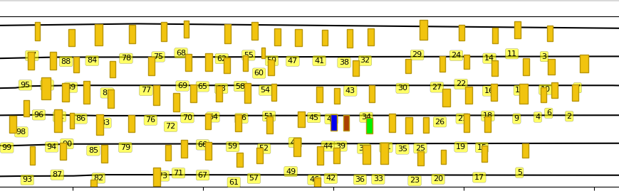

The idea of this repo is to reimplement the ideas from the article
[Lane-Change Detection Based on Vehicle-Trajectory Prediction](https://ieeexplore.ieee.org/document/7835731)

As in article, [publicly available NGSIM dataset](https://ops.fhwa.dot.gov/trafficanalysistools/ngsim.htm) will be used.

Trajectory information is located in already provided csv file in the dataset and road information is extracted
from the provided shapefiles (lanes were interpolated). Both were converted to json
file format.

By taking subset of the data we annotated around 150 situations where vehicle changes the lane
to the right. This information is stored in lc_anno, and it is used for training of the SVM.

The workflow is as follows:
1. Using the trajectory data and annotations features are computed as described in [] and SVM is trained for detection of lane changes
2. To remove false positives, trajectory planner and predictor are used - in case collision occurs during the prediction step it is misclassified lane change

_Example of correctly classified lane change by SVM_

_Example of incorrectly classified lane change by SVM which will be corrected by the trajectory planner_

_Example of incorrectly classified lane changes (first 2 from the left)_

NOTES:
- Trajectory is not filtered in any way
- Features are not scaled (todo)
- Collision check by overlapping bounding boxes script snatched from https://github.com/Farama-Foundation/HighwayEnv (thank you)